# asciiwall

Procedural and image ASCII-art wallpapers for Omarchy (Hyprland), in Rust.

- **Scenes**: `waves`, `plasma`, `noise` (Perlin fBm clouds), `tunnel`, `matrix`, `life` (Conway), `maze` (10 PRINT), plus `image--<name>` - every wallpaper of the current theme converted to ASCII (not in the default rotation; add `"images"`).
- **Plates** (classic ASCII art, still): `lain`, `rei` — PsyBear's 2007 anime portraits, CC BY-NC-SA 3.0, transcribed character by character from the published images (credits and method in [`src/scenes/plates/README.md`](src/scenes/plates/README.md); those files keep their author's license). A plate is scaled to fit the whole piece on each monitor, and cells are widened to the Courier-like proportions it was drawn in.
- **Image scenes**: the picture is sampled in 2×3 regions per cell, sharpened (local unsharp mask, Harri's directional and per-cell contrast) and every cell gets the glyph whose ink has that shape, from a curated set that avoids "text soup". Cells are 0.7× the configured font so detail survives; light-paper drawings are inked in reverse (lines become glyphs, paper stays empty). Glyphs never change while live - a light sweep recolors the picture for 8 s every 45 s, and between sweeps no frame is presented.
- **Shader scenes** (GPU, reinterpreted for ASCII rather than ported): see below.
- **Theme-aware**: glyph colors come from `~/.local/state/omarchy/current/theme/colors.toml`; a `theme-set` hook re-renders on theme change.
- **Static mode**: renders a PNG at the largest monitor's resolution (~100 ms at 4K) and applies it with `omarchy theme bg set`, so the lock screen, transitions and switcher keep working.
- **Live mode**: one wlr-layer-shell surface per monitor on the Bottom layer (above omarchy-shell's background, below windows, click-through), drawn with wgpu on the GPU that drives the monitors. Each frame fills a buffer of (glyph, color) cells — uploaded by CPU scenes, written in place by shader scenes — and a fragment shader expands it through a glyph atlas. Frames are paced by the fps timer *and* the compositor's frame callbacks, so nothing is drawn while a monitor is off; monitors whose active workspace is fullscreen are paused; an unchanged CPU grid is not presented again. A matching static snapshot is still set for the lock screen.
- Rotates to a random enabled scene every `interval_minutes` (default 30).

## Shader scenes

Evaluated once per character cell in a compute shader (256×67 cells on a 4K monitor instead of 8.3 M pixels), so a raymarcher costs a fraction of a millisecond. Most scenes return a field that is sampled at 2×3 points per cell and matched against each glyph's shape (after Alex Harri, ["ASCII characters are not pixels"](https://alexharri.com/blog/ascii-rendering)), so strokes come out as `/ \ | - _ ( )` instead of a brightness ramp. Point scenes scatter tens of thousands of points into that 2×3 grid first. The original eight shader scenes measured ~0.8 % of one CPU core and 0.1–0.6 ms of GPU per frame on an RX 6800 at 4K/30 fps; the rewritten `wave` and `aurora` still need equivalent GPU timestamp profiling.

| scene | inspired by | ASCII take |
|---|---|---|
| `wave` | [Hokusai's *The Great Wave off Kanagawa*](https://www.metmuseum.org/art/collection/search/45434) (public domain) | a curling crest with foam claws and spray, moving streamlines, rolling swells and distant Fuji |
| `singularity` | XorDev's black holes; *Interstellar*'s Gargantua as visual reference | Gargantua seen almost edge-on: an empty shadow and thin photon ring, the near side of the disk crossing in front, the far side lensed into a halo over the top and a thinner one underneath; gas cells take a density ramp (` .-~=+*#%@`), edges take line glyphs, Keplerian streaks orbit faster inward and the approaching side is beamed brighter |
| `aurora` | original boreal nightscape | broad folding ribbons of light above a pine-lined lake, with stars and faint reflections |
| `blossom` | [harshitlog](https://x.com/harshitlog/status/2099485977853231443) | a swaying cherry branch: wood in line glyphs, flowers in `* @ o`, falling petals |
| `koi` | [yuruyurau](https://x.com/yuruyurau)'s point-stream creatures | three koi made of point streams circling a pond with ripple rings; each spine is re-sampled by arc length every frame, so a body keeps its length through slow turns |
| `medusa` | yuruyurau | a pulsing jellyfish of ribs, frilled arms and trailing tentacles, marine snow |
| `glass` | harshitlog — "bend images through glass" | lenses drifting over this shader's own source, magnifying whole cells; rims drawn with `_ / | \ -` |
| `saturn` | [a1k0n/Andy Sloane's `donut.c`](https://www.a1k0n.net/2011/07/20/donut-math.html) lighting method | analytically ray-cast planet with a terminator, drifting bands, Cassini-divided rings, mutual shadows, moons and sparse stars |
| `dandelion` | Fibonacci sphere plus Bridson-style curl-noise wind | a slowly turning seed clock on a hand-set stem; smooth gusts detach persistent parachute seeds and their places regrow |
| `moonsea` | Joan Stark and Rowan Crawford's hand-made ASCII composition principles | full moon, maria, clouds, stars and sailboat over perspective wave rows; moonlight widens into a calm shimmering path |

The code is original; only ideas are borrowed. Authors whose tweet shaders are referenced above are credited here — please credit them too if you build on these.

## Animated gallery

Each GIF shows ten seconds of the scene. Click it for the **1280×720 H.264 MP4** to post on X. These clips use the theme colors active when exported; `lain` and `rei` are still plates, so they have no animation clips.

| Scene | GIF preview → MP4 |
|---|---|
| `waves` | [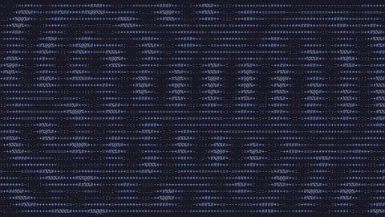](media/mp4/waves.mp4) |
| `plasma` | [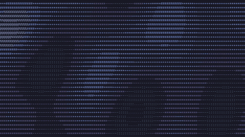](media/mp4/plasma.mp4) |
| `noise` | [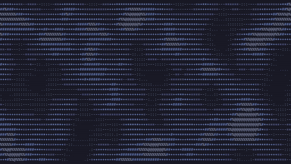](media/mp4/noise.mp4) |
| `tunnel` | [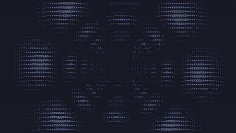](media/mp4/tunnel.mp4) |
| `matrix` | [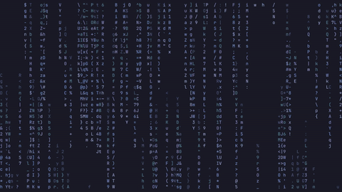](media/mp4/matrix.mp4) |
| `life` | [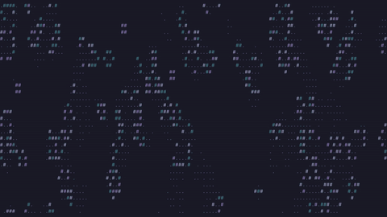](media/mp4/life.mp4) |
| `maze` | [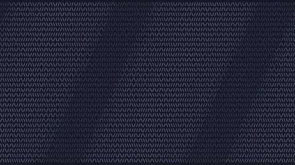](media/mp4/maze.mp4) |
| `wave` | [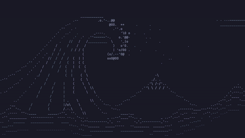](media/mp4/wave.mp4) |
| `singularity` | [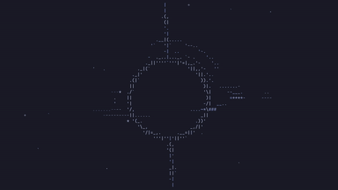](media/mp4/singularity.mp4) |
| `aurora` | [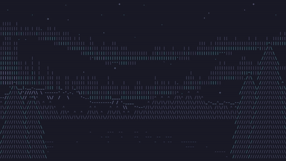](media/mp4/aurora.mp4) |
| `blossom` | [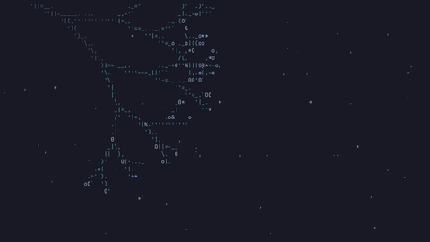](media/mp4/blossom.mp4) |
| `koi` | [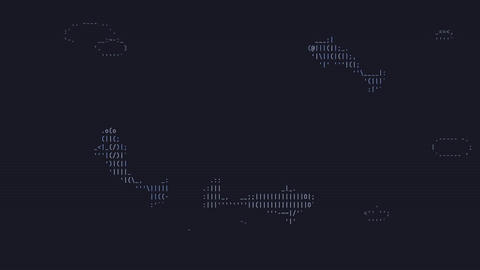](media/mp4/koi.mp4) |
| `medusa` | [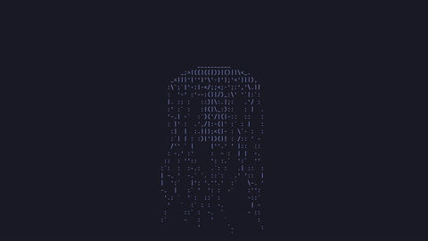](media/mp4/medusa.mp4) |
| `glass` | [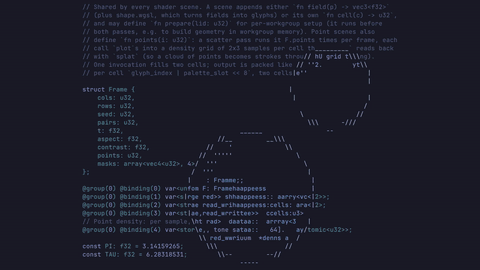](media/mp4/glass.mp4) |
| `saturn` | [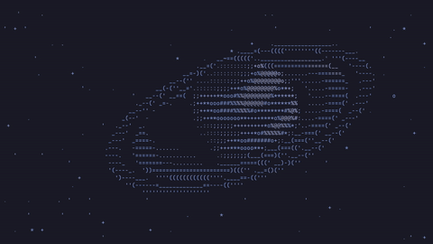](media/mp4/saturn.mp4) |
| `dandelion` | [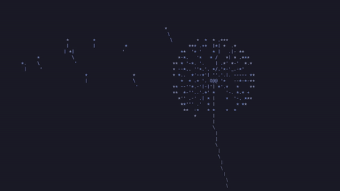](media/mp4/dandelion.mp4) |
| `moonsea` | [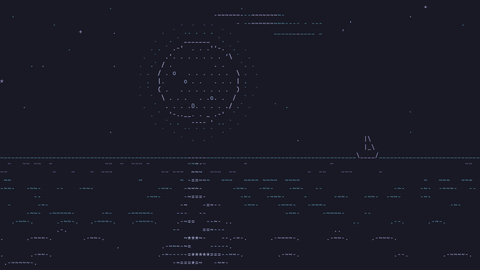](media/mp4/moonsea.mp4) |

From the checkout, run `asciiwall media --out-dir media` to regenerate every enabled animated scene in the current theme (`--scene wave` for one). Requires ffmpeg; MP4s are 24 fps, GIFs 8 fps with a limited palette for reasonable README load time. Refresh the picker's separate three-second WebP loops with `asciiwall gallery`.

## Install

On Omarchy:

```sh
git clone https://github.com/iuri1911/asciiwall.git
cd asciiwall
./scripts/install.sh
```

That builds the release binary into `~/.local/bin/asciiwall`, enables the user
service, installs the `theme-set` hook with `omarchy hook install`, and merges
the Style menu entries. Nothing under `/usr/share/omarchy` is changed. The same
command updates an existing install. `./scripts/install.sh uninstall` removes
the integration and leaves `~/.config/asciiwall`; `--purge` also deletes config,
gallery, and packs. Details and the pack contract are in `CONTRIBUTING.md`.

## Usage

```
asciiwall list                      # scene ids
asciiwall next                      # random scene now (does nothing while off)
asciiwall set <scene-id|gallery.png> # while off, also turns asciiwall on
asciiwall power on|off|toggle       # off restores the stock background and stops the service
asciiwall pick                      # scene picker over the ASCII gallery (stock picker while off)
asciiwall mode live|static|toggle   # saves config, restarts the service when changed
asciiwall interval <minutes>       # 0 disables rotation; manual next/set still work
asciiwall status enabled|mode|interval|scene|tempo
asciiwall tempo [low|medium|high] [--scene ID]
asciiwall check [pack-dir]
asciiwall render <scene> out.png [--width W --height H --font-px P --seed S --time T]
asciiwall gallery [--previews]      # re-render thumbnails and loops; --previews: missing loops only
asciiwall media [--out-dir media] [--scene ID] # export 10 s GIF and X-ready MP4 clips
asciiwall daemon                    # what the systemd unit runs
```

Style → ASCII Wallpaper → **Turn Off** goes back to the theme's normal
wallpaper (the stock image that was showing before asciiwall, or the theme's
first one) and stops the service; Omarchy's own background picker and theme
changes then behave as if asciiwall were not installed. **Turn On** brings back
the last ASCII scene.

### Animated picker

Style → Background (SUPER+CTRL+SPACE) runs `asciiwall pick`, which opens
`asciiwall.picker`: Omarchy's own image-picker carousel, adapted as an Omarchy
shell plugin (`~/.config/omarchy/plugins/asciiwall.picker`, installed and
enabled by `./scripts/install.sh`). The selected tile plays a 3 s loop of the
scene, starting from its thumbnail's frame. Loops are lossless animated WebP
made with ffmpeg, kept per theme in `~/.local/share/asciiwall/previews/`, and
rendered in the background when the picker opens after a theme or scene-list
change (about 0.5 s per scene); until then a tile shows its still. Without the
plugin (or if the shell does not open it) `pick` falls back to Omarchy's still
image picker; without ffmpeg the plugin shows stills. After an update that
changes the plugin, `omarchy-restart-shell` loads the new version.

Double-clicking the bare desktop opens the same picker. Omarchy's background
service would open its still image picker there; the plugin's `Desktop.qml`
service lays a transparent, input-only surface over it (Bottom layer,
namespace `asciiwall-desktop`) that runs `asciiwall pick` on a left
double-click, which is Omarchy's own picker again while asciiwall is off. A
right double-click still opens the theme switcher.

## Config

`~/.config/asciiwall/config.toml` (all keys optional):

```toml
mode = "live"              # "live" | "static"
interval_minutes = 30     # 0 disables automatic rotation
fps = 30
font_family = "JetBrainsMono Nerd Font Mono"
font_size = 16             # em size in logical px
scenes = ["waves", "plasma", "noise", "tunnel", "matrix", "life", "maze", "plates", "shaders"]
```

`"images"` expands to every image in `~/.config/omarchy/backgrounds/<theme>/` and the theme's own `backgrounds/`; `"plates"` to every classic ASCII plate; `"shaders"` to every built-in shader scene; `"packs"` to every valid directory under `~/.config/asciiwall/packs` and `~/.local/share/asciiwall/packs`. A pack is listable before it is added to rotation.

Per-scene pace, remembered across switches. Missing means Natural, which is the pace the scene was written at (a pack may set `pulse` so Natural is already slower or faster). Slow is half of that, Fast is double. The live daemon scales the clock step, not the absolute time, so changing pace does not jump or rewind the picture. Static mode ignores it.

```toml
[tempo]
koi = "low"
aurora = "high"
```

```sh
asciiwall tempo                 # print the current scene
asciiwall tempo low             # remember Slow for the scene on screen
asciiwall tempo high --scene koi
asciiwall status tempo          # low | medium | high, for the menu checkmark
asciiwall check                 # built-in shader contract
asciiwall check path/to/pack    # one contributed pack
```

Style → ASCII Wallpaper → Tempo is the same setting (Slow / Natural / Fast, searchable as Baixa / Média / Alta). It applies within a second while live; no service restart.

## Uninstall

```sh
./scripts/install.sh uninstall
```
